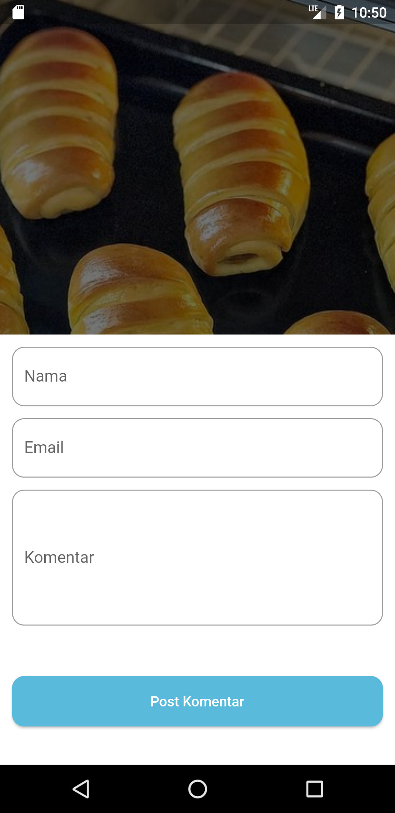
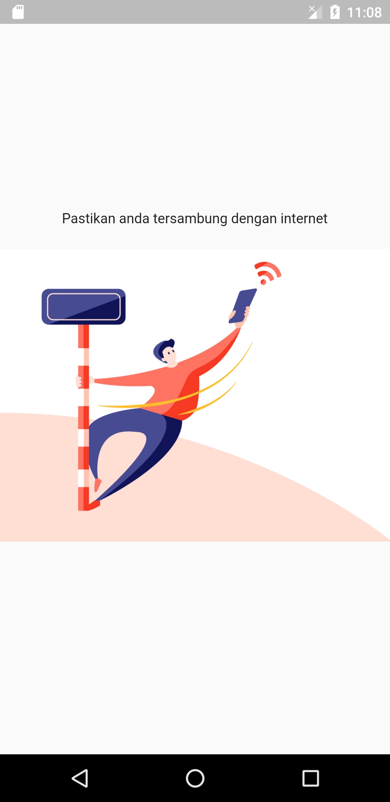

# Beritakan (News App)

### Description
Project A news application made using Flutter as the front end and using an API created using Laravel.

## Screenshots

 |  | 

 |  | 

## My Roles
- Mobile App Developer (Flutter)

### App Features
- Consume API (GET, POST)
- Check Internet Connection

### Package using
- Consume API - [http](https://pub.dev/packages/http)
- Check Connection - [connectivity](https://pub.dev/packages/connectivity)
- State Management - [get](https://pub.dev/packages/get)
- Awesome Loading Indicator - [flutter_spinkit](https://pub.dev/packages/flutter_spinkit)
- Create App Icon - [flutter_launcher_icons](https://pub.dev/packages/flutter_launcher_icons)
- Image Slider - [carousel_slider](https://pub.dev/packages/carousel_slider)

### Tech Used
  

